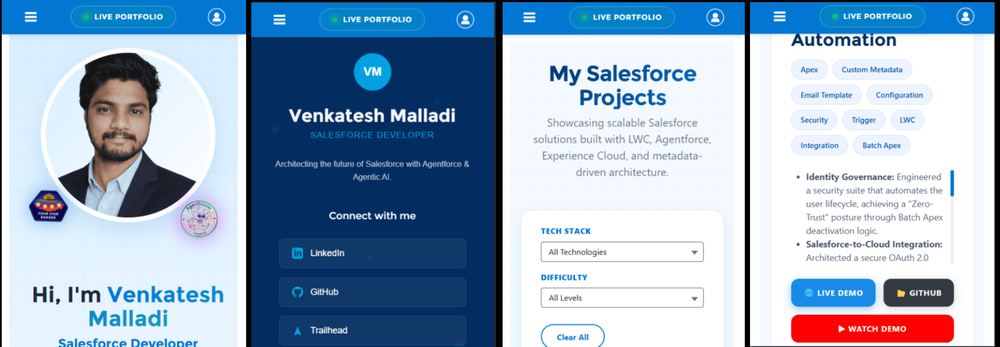
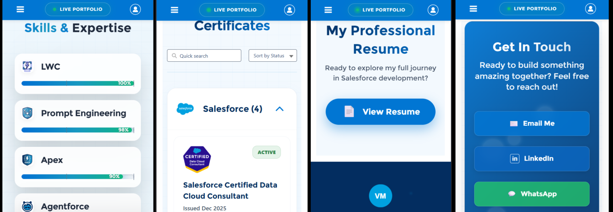

# Metadata-Driven LWC Portfolio on Experience Cloud (LWR)

A modern, **zero-hardcode**, fully dynamic portfolio website built on **Salesforce Experience Cloud (LWR)** using Lightning Web Components.

This project showcases a production-grade, maintainable architecture where all content (projects, skills, certifications, etc.) can be updated **without any code deployment** — purely through **Custom Metadata Types**.


## ✨ Key Features

- **Zero-Hardcode Architecture** – All portfolio content is driven by Custom Metadata Records
- **Dynamic LWC Components** – Fully reactive, reusable, and performant Lightning Web Components
- **Advanced Filtering** – Multi-dimensional filtering (Tech Stack, Difficulty, Date, etc.)
- **Secure Guest User Experience** – Optimized Apex backend with proper sharing & security model
- **Fully Responsive Design** – Optimized for desktop, tablet, and mobile
- **LWR (Lightning Web Runtime)** – Built on modern Experience Cloud architecture
- **Enterprise-Grade Code Quality** – Clean service layer, proper separation of concerns, and maintainability focus

## 🚀 Live Demo

> **Live Portfolio**: https://ddm00000fpkymuan-dev-ed.develop.my.site.com/venkateshPortfolio/s

## ▶️ Watch Demo

> **Youtube**: I will Update soon ......

## 🛠️ Tech Stack

- **Frontend**: Lightning Web Components (LWC), LWR
- **Backend**: Apex, Custom Metadata Types
- **Platform**: Salesforce Experience Cloud (Experience Site)
- **Other**: Triggers, Configuration, Sharing Rules 

## 📋 Project Highlights

### Scalable Architecture
Engineered a dynamic portfolio on Salesforce Experience Cloud (LWR) using a **"Zero-Hardcode"** design pattern, allowing content updates via Custom Metadata without any code deployments.

### High-Performance Backend
Developed a robust Apex service layer to fetch and render complex data models, optimized for **guest user security** and real-time performance.

### Advanced UI/UX
Built reactive LWC components featuring multi-dimensional filtering, seamless GitHub API integration, and fully responsive layouts.

### Enterprise Delivery
Demonstrated strong expertise in LWR site architecture, secure data modeling, and production-ready development standards.

## 📁 Project Structure

```bash
metadata-driven-lwc-portfolio/
├── force-app/
│   ├── main/
│   │   ├── default/
│   │   │   ├── classes/               # Apex Controller class
│   │   │   ├── customMetadata/        # Custom Metadata Types + Records
│   │   │   ├── experiences/           # Experience Site configuration
│   │   │   ├── lwc/                   # All Lightning Web Components
│   │   │   ├── triggers/              # Supporting triggers 
│   │   │   ├── permissionset/         # Custom permissionsets
│   │   │   └── objects/               # custom objects and standard objects
│   │   │   
│   └── ...
├── screenshots/                      
└── README.md

```
## 📸 Screenshots

1. Home / Portfolio Landing Page


2. Quick Links


3. Projects Section with Filters


4. Skills section


5. Certificates


6. Resume


7. Contact


8. Footer


## 📱✨ Mobile View
1. Home , Footer , Projects


2. Skills, Certificates, Resume , Contact



<h2>🏗️ Architecture Highlights</h2>

<table>
  <tr>
    <td valign="top" width="50%">
      <h3>⚙️ Custom Metadata Driven</h3>
      <ul>
        <li>Zero-hardcoded values in LWC components</li>
        <li>No-deployment content updates</li>
        <li>Business-managed via Admin UI</li>
      </ul>
    </td>
    <td valign="top" width="50%">
      <h3>🧱 Service Layer Pattern</h3>
      <ul>
        <li>Clean separation between UI and business logic</li>
        <li>Fully testable Apex controllers</li>
        <li>Enterprise-grade maintainability</li>
      </ul>
    </td>
  </tr>
  <tr>
    <td valign="top" width="50%">
      <h3>⚡ Optimized Apex</h3>
      <ul>
        <li>Governor-limit safe design</li>
        <li>Optimized SOQL and DML patterns</li>
      </ul>
    </td>
    <td valign="top" width="50%">
      <h3>🔒 Guest User Optimized</h3>
      <ul>
        <li>Secure data exposure for public Experience Sites</li>
        <li>LWR-ready architecture</li>
        <li>Performance-focused guest access design</li>
      </ul>
    </td>
  </tr>
</table>

<h2>🎯 Architect Skills Demonstrated</h2>

<table>
  <tr>
    <td valign="top" width="50%">
      <ul>
        <li><strong>Metadata-Driven Development</strong><br>Production-grade dynamic content systems</li>
        <li><strong>LWR + Experience Cloud</strong><br>End-to-end site architecture expertise</li>
      </ul>
    </td>
    <td valign="top" width="50%">
      <ul>
        <li><strong>Enterprise Solution Design</strong><br>Security, scalability, and maintainability focus</li>
        <li><strong>Salesforce Best Practices</strong><br>Service layers, and guest security</li>
      </ul>
    </td>
  </tr>
</table>

<h2>🔮 Planned Enhancements</h2>

<ol>
  <li>🎨 Dark/Light Mode Toggle</li>
  <li>📝 CMS-Driven Blog / Articles</li>
  <li>📊 Real-Time Analytics Dashboard</li>
  <li>🌍 Multi-Language Support</li>
</ol>


<h2>👨‍💻 Author</h2>

<p>
  <strong>Venkatesh M</strong><br>
  Salesforce Developer | Capgemini | India
</p>