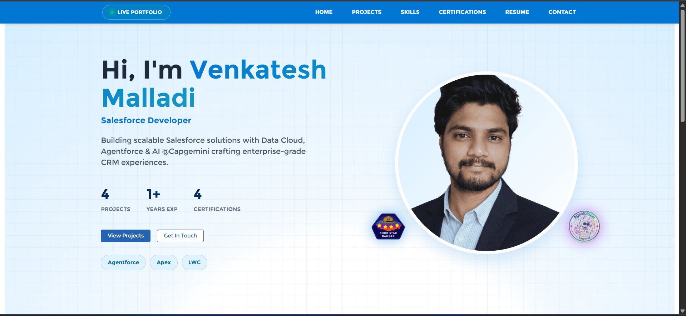
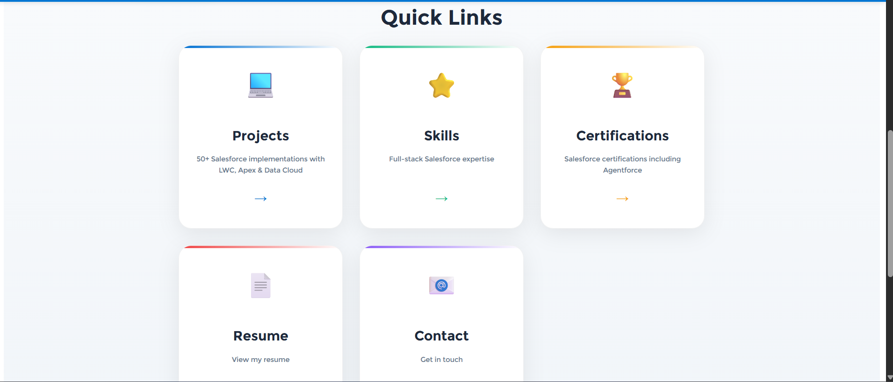
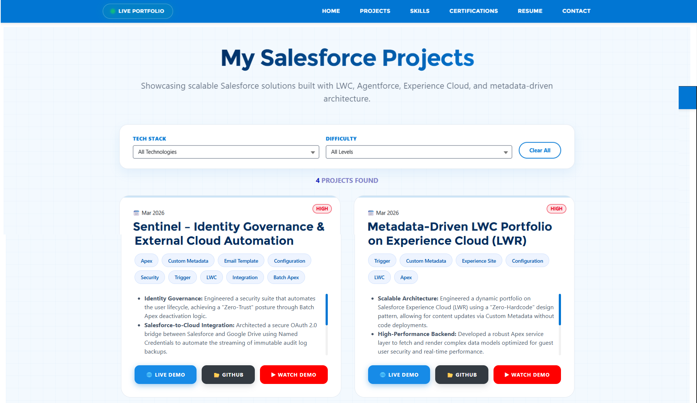
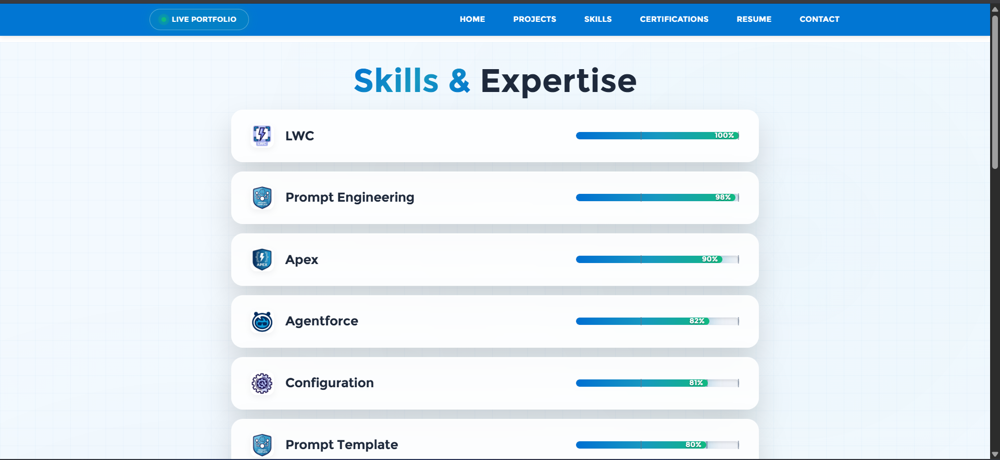
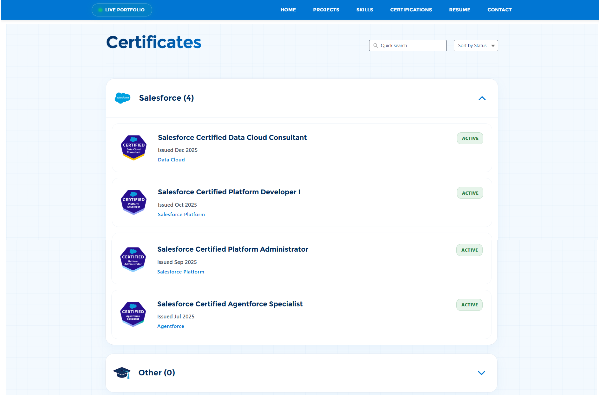
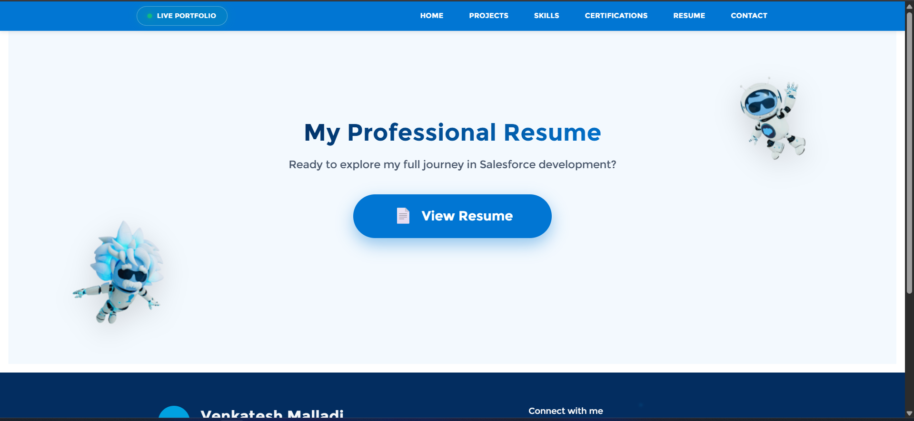
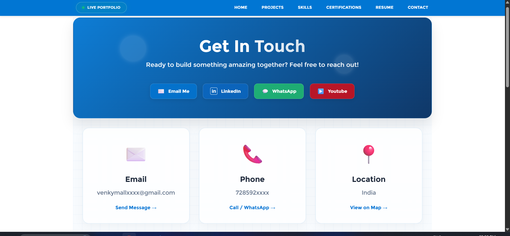
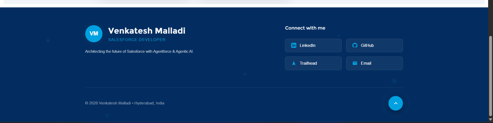

# Metadata-Driven LWC Portfolio on Experience Cloud (LWR)

A modern, **zero-hardcode**, fully dynamic portfolio website built on **Salesforce Experience Cloud (LWR)** using Lightning Web Components.

This project showcases a production-grade, maintainable architecture where all content (projects, skills, certifications, etc.) can be updated **without any code deployment** — purely through **Custom Metadata Types**.


## ✨ Key Features

- **Zero-Hardcode Architecture** – All portfolio content is driven by Custom Metadata Records
- **Dynamic LWC Components** – Fully reactive, reusable, and performant Lightning Web Components
- **Advanced Filtering** – Multi-dimensional filtering (Tech Stack, Difficulty, Date, etc.)
- **Secure Guest User Experience** – Optimized Apex backend with proper sharing & security model
- **Fully Responsive Design** – Optimized for desktop, tablet, and mobile
- **LWR (Lightning Web Runtime)** – Built on modern Experience Cloud architecture
- **Enterprise-Grade Code Quality** – Clean service layer, proper separation of concerns, and maintainability focus

## 🚀 Live Demo

> **Live Portfolio**: https://ddm00000fpkymuan-dev-ed.develop.my.site.com/venkateshPortfolio/s

## 🛠️ Tech Stack

- **Frontend**: Lightning Web Components (LWC), LWR
- **Backend**: Apex, Custom Metadata Types
- **Platform**: Salesforce Experience Cloud (Experience Site)
- **Other**: Triggers, Configuration

## 📋 Project Highlights

### Scalable Architecture
Engineered a dynamic portfolio on Salesforce Experience Cloud (LWR) using a **"Zero-Hardcode"** design pattern, allowing content updates via Custom Metadata without any code deployments.

### High-Performance Backend
Developed a robust Apex service layer to fetch and render complex data models, optimized for **guest user security** and real-time performance.

### Advanced UI/UX
Built reactive LWC components featuring multi-dimensional filtering, seamless GitHub API integration, and fully responsive layouts.

### Enterprise Delivery
Demonstrated strong expertise in LWR site architecture, secure data modeling, and production-ready development standards.

## 📁 Project Structure

```bash
metadata-driven-lwc-portfolio/
├── force-app/
│   ├── main/
│   │   ├── default/
│   │   │   ├── classes/               # Apex Controller class
│   │   │   ├── customMetadata/        # Custom Metadata Types + Records
│   │   │   ├── experiences/           # Experience Site configuration
│   │   │   ├── lwc/                   # All Lightning Web Components
│   │   │   ├── triggers/              # Supporting triggers 
│   │   │   ├── permissionset/         # Custom permissionsets
│   │   │   └── objects/               # custom objects and standard objects
│   │   │   
│   └── ...
├── screenshots/                      
└── README.md

```
## 📸 Screenshots

1. Home / Portfolio Landing Page

3. Quick Actions

3. Projects Section with Filters

4. Skills section

5. Certificates

6. Resume

7. Contact

8. Footer


🏗️ Architecture Highlights

Custom Metadata Driven – No hardcoded values in components
Service Layer Pattern – Clean separation between UI and business logic
Bulkified & Optimized Apex – Governor limit safe
Guest User Optimized – Secure and performant for public Experience Sites
Reusable Components – Designed for scalability and future enhancements

🎯 Learning & Achievements

Mastered Metadata-Driven Development in Salesforce
Deep understanding of LWR architecture and Experience Cloud
Built production-ready, maintainable, and scalable solutions
Strong focus on security, performance, and maintainability

🔮 Future Enhancements (Planned)

Dark/Light mode toggle
Blog / Articles section (CMS-driven)
Real-time project analytics dashboard
Multi-language support


How to Deploy

Clone the repository
Use Salesforce CLI or VS Code + Salesforce Extension Pack
Deploy to your org:Bashsf project deploy start
Create necessary Custom Metadata Types and load sample records
Activate and configure the Experience Site


Built with ❤️ by Venkatesh M
Salesforce Developer | Hyderabad