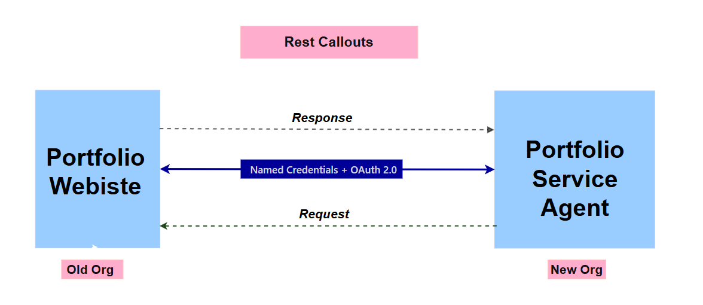
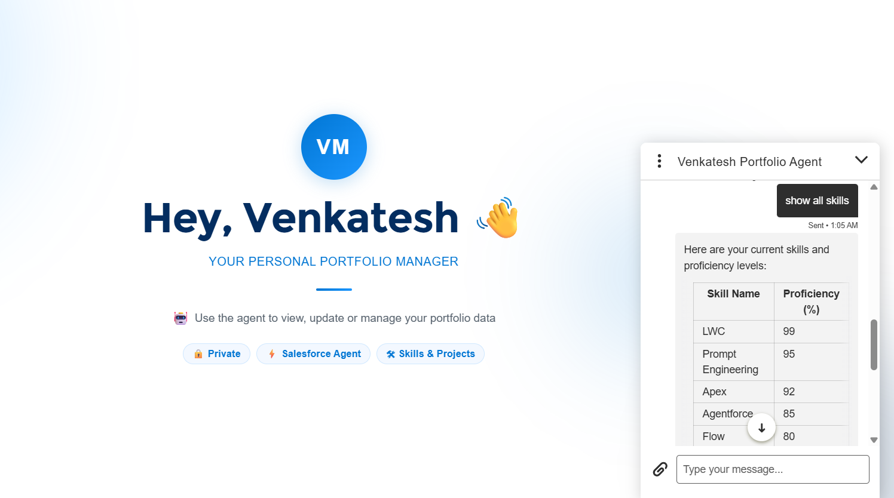
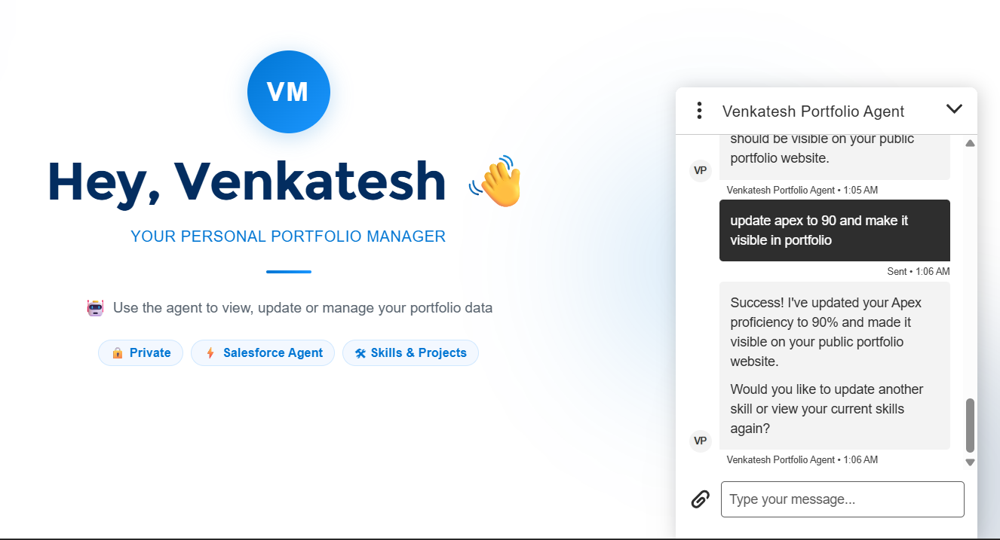

# 🚀 AI-Powered & Metadata-Driven LWC Portfolio
### Salesforce Experience Cloud (LWR) + Agentforce + Cross-Org Integration

&descSize=18&descAlignY=60&animation=twinkling)

This project showcases a production-grade, **zero-hardcode** portfolio architecture. Beyond dynamic rendering via Custom Metadata, it features an **integrated Agentforce Service Agent** that acts as a conversational administrative console to manage professional data in real-time.

---
## 🏗️ Architectural Challenge & Innovation

| **The Problem** | **The Solution** |
| :--- | :--- |
| My primary Portfolio Org (hosting the Experience Site) was not **Agentforce-enabled**, creating a technical roadblock for deploying a native Service Agent for real-time site management. | I engineered a **Cross-Org AI Orchestration** layer. I deployed the Service Agent in a modern, Agentforce-enabled "Management Org" and bridged the gap using a secure **Named Credentials + OAuth 2.0** framework to control the Portfolio Org via REST APIs. |

---

## 📸 Modal Diagram



## 🧠 Sentinel AI Governance
The portfolio includes an autonomous **Agentforce Assistant** that serves as a bridge between the Experience Site and the backend data layer.

* **Conversational Management**: Fetch current skill proficiencies or trigger remote updates via natural language.
* **Dispatcher Pattern Apex**: A sophisticated single-class routing architecture (`PortfolioAgentActions`) that bypasses platform limits to handle multiple AI intents (Fetch/Update).
* **Secure Cross-Org Bridge**: Leverages **Named Credentials (OAuth 2.0)** to securely modify data in a remote Salesforce environment via REST APIs.
* **Embedded Messaging**: Seamlessly integrated into the LWR site footer for instant administrative control.

---

## ✨ Key Features

- **Zero-Hardcode Architecture** – 100% of content is driven by Custom Metadata Records.
- **Agentforce Service Agent** – Headless administrative layer for conversational data updates.
- **LWR (Lightning Web Runtime)** – Built on Salesforce’s fastest, modern site architecture.
- **Advanced Filtering** – Multi-dimensional LWC filtering logic for projects and technical stacks.
- **Secure Guest User Model** – Optimized Apex backend with hardened security for public exposure.
- **Enterprise-Grade Quality** – Strict separation of concerns using a Service Layer Pattern.

---
## 🚀 Live Demo

> **Live Portfolio**: https://ddm00000fpkymuan-dev-ed.develop.my.site.com/venkateshPortfolio/s

## ▶️ Watch Demo

> **Youtube**: I will Update soon ......

### 💻 Tech Stack & Core Competencies

| Domain | Technologies & Frameworks |
| :--- | :--- |
| **AI & Automation** |   |
| **Frontend / UX** |    |
| **Backend / Logic** |    |
| **Platform** |   |
| **Security & Config** |    |

---

## 📁 Project Structure

```bash
metadata-driven-lwc-portfolio/
├── force-app/
│   ├── main/
│   │   ├── default/
│   │   │   ├── classes/               # Apex Controller class
│   │   │   │      ├── CustomMetadataUtil
│   │   │   │      └── ProjectTriggerHandler
│   │   │   │
│   │   │   ├── customMetadata/        # Custom Metadata Types + Records
│   │   │   ├── experiences/           # Experience Site configuration
│   │   │   ├── lwc/                   # All Lightning Web Components
│   │   │   │      ├── contactPage
│   │   │   │      ├── portfolioCertifications
│   │   │   │      ├── portfolioFooter
│   │   │   │      ├── portfolioSkills
│   │   │   │      ├── portfolioNav
│   │   │   │      ├── projectsPage
│   │   │   │      ├── quickNavLinks
│   │   │   │      ├── resumePage
│   │   │   │      └── ProjectTriggerHandler
│   │   │   │
│   │   │   ├── triggers/              # Supporting triggers 
│   │   │   ├── permissionset/         # Custom permissionsets
│   │   │   └── objects/               # custom objects and standard objects
│   │   │   
│   └── ...
├── screenshots/                      
└── README.md

```
## 📸 Screenshots (Service Agent Created Org)

1. Fetch All Skills


2. Update Skill with proficiency + Visibility in UI



## 📸 Screenshots (Portfolio Deployed Org)

1. Home / Portfolio Landing Page


2. Quick Links


3. Projects Section with Filters


4. Skills section


5. Certificates


6. Resume


7. Contact


8. Footer


## 📱✨ Mobile View
1. Home , Footer , Projects


2. Skills, Certificates, Resume , Contact


---

## 🏗️ Architecture Highlights

<table>
  <tr>
    <td valign="top" width="50%">
      <h3>🤖 AI Dispatcher Pattern</h3>
      <ul>
        <li>Single Invocable entry-point for multi-intent AI actions</li>
        <li>Dynamic routing logic for Fetch vs. Update operations</li>
        <li>Automated Slot Filling for data integrity</li>
      </ul>
    </td>
    <td valign="top" width="50%">
      <h3>🧱 Cross-Org Integration</h3>
      <ul>
        <li>Secure communication via Named Credentials</li>
        <li>Remote JSON payload processing</li>
        <li>Decoupled Site Management vs. Data Source</li>
      </ul>
    </td>
  </tr>
  <tr>
    <td valign="top" width="50%">
      <h3>⚙️ Metadata-Driven UI</h3>
      <ul>
        <li>Zero hardcoded strings in LWC components</li>
        <li>No-deployment content updates</li>
        <li>Scalable data model for rapid expansion</li>
      </ul>
    </td>
    <td valign="top" width="50%">
      <h3>🔒 Enterprise Security</h3>
      <ul>
        <li>Hardened Guest User Access for LWR</li>
        <li>Clean Service Layer for logic encapsulation</li>
        <li>Optimized SOQL and Governor Limit management</li>
      </ul>
    </td>
  </tr>
</table>

---

</table>

<h2>🔮 Planned Enhancements</h2>

<ol>
  <li>🎨 Dark/Light Mode Toggle</li>
  <li>📝 CMS-Driven Blog / Articles</li>
  <li>📊 Real-Time Analytics Dashboard</li>
  <li>🌍 Multi-Language Support</li>
</ol>


<h2>👨‍💻 Author</h2>

<p>
  <strong>Venkatesh M</strong><br>
  Salesforce Developer | Capgemini | India
</p>